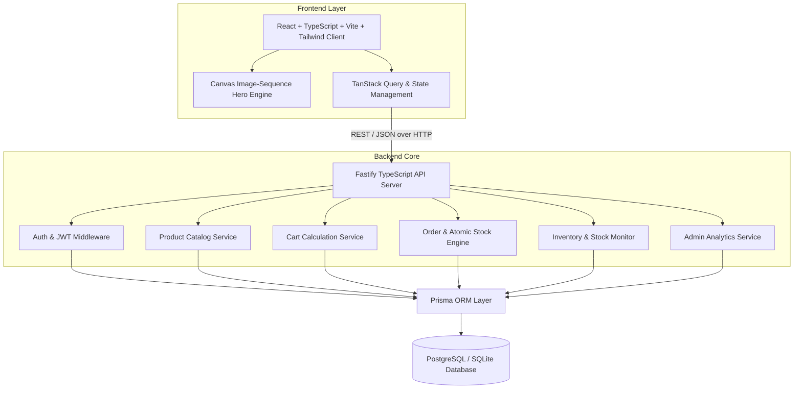
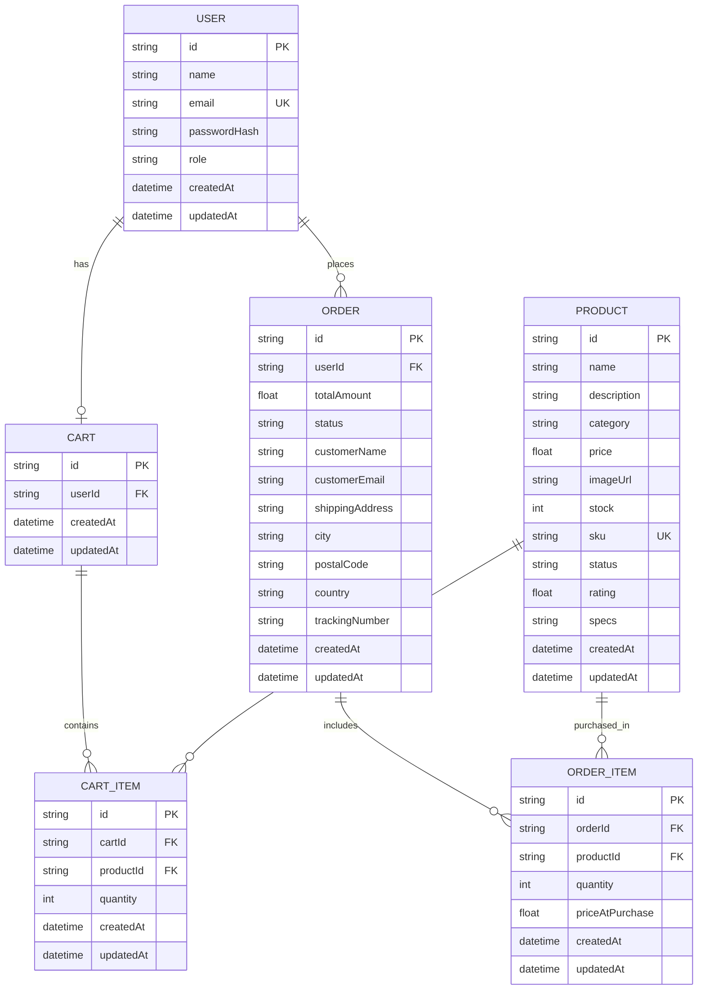
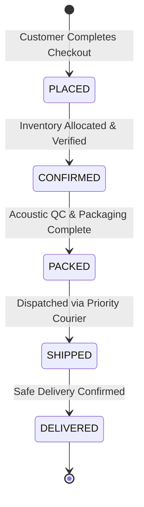

# Software Requirements Specification (SRS)
## NEXORO — Precision-Engineered E-Commerce Platform

**Document Version:** 1.0.0  
**Date:** September 2026  
**Status:** Approved & Implemented  
**Target Environment:** Node.js 20+, Fastify, React 18, PostgreSQL / SQLite, Prisma ORM  

---

## 1. Executive Summary

NEXORO is a premier technology-commerce platform purpose-built for high-end acoustic systems, planar transducers, and studio amplification hardware. The application bridges a signature scroll-driven HTML5 Canvas exploded-view hero narrative with a robust full-stack e-commerce engine, real-time inventory management, atomic stock validation, and comprehensive order lifecycle telemetry.

---

## 2. Problem Statement

Modern consumer electronics commerce platforms frequently suffer from generic aesthetic templates, disconnected product visualizations, and detached administrative dashboards. In high-value categories like audiophile hardware, customers demand granular transparency into internal acoustic architecture, real-time stock assurance, and precision order dispatch tracking. Concurrently, merchants require instantaneous catalog modifications, inventory telemetry, and lifecycle status synchronization.

---

## 3. System Objectives

- **Visual Differentiation:** Deliver a high-performance 300-frame sequential canvas engine that communicates internal mechanical and electroacoustic engineering without heavyweight 3D model overhead.
- **Transactional Reliability:** Enforce zero-compromise atomic database transactions for order creation, stock decrementation, and price-at-purchase preservation.
- **Administrative Control:** Provide merchant operations teams with real-time revenue analytics, inline inventory adjustments, and status progression controls.
- **Responsiveness & Accessibility:** Ensure smooth operation across mobile, tablet, and ultra-wide displays with strict semantic HTML standards and modern typography.

---

## 4. System Architecture

NEXORO is architected as a modular monolith with decoupled client and server boundaries communicating over typed RESTful JSON APIs.

---

## 5. User Roles & Personas

| Role | Permissions & Responsibilities |
|---|---|
| **CUSTOMER** | Browse catalog, search/filter hardware, manage cart, place orders, receive instant confirmations, view purchase history, and track real-time 5-stage shipment telemetry. |
| **ADMIN** | Authenticate to Operations Suite, view gross revenue and sales velocity analytics, create/edit/deactivate catalog products, monitor low-stock thresholds, and update customer order lifecycle states. |

---

## 6. Functional Requirements Matrix

### Customer Requirements (FR-01 – FR-18)
- **FR-01:** System shall render a 300-frame scroll-synchronized exploded-view canvas hero on the homepage.
- **FR-02:** System shall allow customers to browse active hardware systems across categorized views.
- **FR-03:** System shall provide real-time keyword search across product name, description, category, and SKU.
- **FR-04:** System shall support multi-category filtering (Headphones, Amplification, Accessories, Acoustics).
- **FR-05:** System shall support multi-attribute sorting (Price Asc/Desc, Model Name, Rating, Newest).
- **FR-06:** System shall provide dedicated product detail pages with high-resolution imagery and specifications.
- **FR-07:** System shall allow adding products to a persistent shopping cart with quantity limits bound to live stock.
- **FR-08:** System shall allow increasing and decreasing item quantities directly from the cart drawer and cart page.
- **FR-09:** System shall allow deleting individual items or clearing the entire shopping cart.
- **FR-10:** System shall automatically calculate and display item totals, cart subtotal, estimated tax (8%), and shipping.
- **FR-11:** System shall grant free shipping for orders exceeding $150.00.
- **FR-12:** System shall provide a dedicated Cart Review page prior to order finalization.
- **FR-13:** System shall collect customer delivery information (Name, Email, Street Address, City, Postal Code, Country).
- **FR-14:** System shall validate stock availability atomically on the backend during order placement.
- **FR-15:** System shall generate an immutable order record and return an Order Confirmation screen with unique tracking IDs.
- **FR-16:** System shall allow customers to view their historical orders under "My Orders".
- **FR-17:** System shall provide an interactive 5-stage order telemetry timeline (`PLACED` &rarr; `CONFIRMED` &rarr; `PACKED` &rarr; `SHIPPED` &rarr; `DELIVERED`).
- **FR-18:** System shall highlight the active status in signature Copper tone with glowing indicators.

### Admin Requirements (FR-19 – FR-30)
- **FR-19:** System shall provide secure Admin authentication with role-based JWT verification.
- **FR-20:** System shall display executive metrics (Total Revenue, Total Orders, Active SKUs, Pending Orders, Low Stock Count).
- **FR-21:** System shall render sales velocity area charts and order distribution charts using Recharts.
- **FR-22:** System shall display urgent low-stock priority alerts (&le; 5 units) on the dashboard.
- **FR-23:** System shall provide a complete Product Management table with search and category filtering.
- **FR-24:** System shall allow adding new hardware systems with SKU, pricing, category, description, and imagery.
- **FR-25:** System shall allow updating existing product metadata and stock allocations.
- **FR-26:** System shall safely handle product deletions by marking referenced products as `INACTIVE` to protect historical orders.
- **FR-27:** System shall provide a dedicated Inventory Monitor with inline quick-stock adjustments.
- **FR-28:** System shall allow filtering inventory by In Stock, Low Stock (&le; 5 units), and Out of Stock (0 units).
- **FR-29:** System shall display all customer orders with buyer metadata, tracking numbers, and financial totals.
- **FR-30:** System shall allow administrators to update order status with immediate database persistence and UI feedback.

---

## 7. Non-Functional Requirements (NFR-01 – NFR-10)

- **NFR-01 (Performance):** Hero canvas sequence must load initial 25 frames immediately and stream subsequent frames in background without blocking main-thread scrolling.
- **NFR-02 (Frame Rate):** Scroll-driven canvas rendering must utilize `requestAnimationFrame` to target steady 60 FPS transitions.
- **NFR-03 (Data Integrity):** Order creation and stock decrement must execute inside an atomic database transaction (`prisma.$transaction`).
- **NFR-04 (Price Historical Accuracy):** Order items must record `priceAtPurchase` to ensure future catalog price changes do not alter past receipts.
- **NFR-05 (Security):** Passwords must be hashed using bcrypt (cost factor 10). JWT tokens must be signed with a cryptographically secure secret.
- **NFR-06 (Authorization):** Admin API endpoints (`/api/admin/*`, `/api/inventory/*`, `POST/PUT/DELETE /api/products/*`) must strictly block non-admin tokens with HTTP 403 Forbidden.
- **NFR-07 (Responsiveness):** UI must fully adapt to mobile (&lt;640px), tablet (640px–1024px), and desktop (&gt;1024px) viewport widths without horizontal overflow.
- **NFR-08 (Aesthetics):** Visual identity must adhere strictly to the NEXORO color system: Obsidian (`#070707`), Deep Graphite (`#111214`), Charcoal (`#1A1C1F`), Warm Ivory (`#F5F1EA`), and Copper (`#C8834A`).
- **NFR-09 (Zero Dead Links):** All UI buttons, filters, modal triggers, and actions must connect to live application logic.
- **NFR-10 (Error Resilience):** API must return structured JSON error payloads with meaningful validation messages.

---

## 8. Database Entity-Relationship Diagram

---

## 9. API Specifications

| Method | Endpoint | Protection | Description |
|---|---|---|---|
| `POST` | `/api/auth/register` | Public | Register customer or admin user |
| `POST` | `/api/auth/login` | Public | Authenticate user and issue JWT |
| `GET` | `/api/auth/me` | Bearer JWT | Fetch current user profile & active cart |
| `GET` | `/api/products` | Public | List products with search, category, stock, sort |
| `GET` | `/api/products/:id` | Public | Fetch product details & related items |
| `POST` | `/api/products` | Admin Only | Create new hardware product |
| `PUT` | `/api/products/:id` | Admin Only | Update existing product |
| `DELETE` | `/api/products/:id` | Admin Only | Safe delete / deactivate product |
| `GET` | `/api/cart` | Bearer JWT | Retrieve user cart with calculated subtotal, tax, shipping |
| `POST` | `/api/cart/items` | Bearer JWT | Add product to cart with stock validation |
| `PUT` | `/api/cart/items/:id` | Bearer JWT | Update item quantity in cart |
| `DELETE` | `/api/cart/items/:id` | Bearer JWT | Remove single item from cart |
| `DELETE` | `/api/cart/clear` | Bearer JWT | Clear all items from user cart |
| `POST` | `/api/orders` | Bearer JWT | Atomic checkout and stock reduction |
| `GET` | `/api/orders` | Bearer JWT | List current user's order history |
| `GET` | `/api/orders/:id` | Bearer JWT | Fetch detailed order tracking telemetry |
| `GET` | `/api/admin/dashboard` | Admin Only | Get analytics, KPI metrics, sales trend, status breakdown |
| `GET` | `/api/admin/orders` | Admin Only | List all customer orders |
| `PUT` | `/api/admin/orders/:id/status` | Admin Only | Update order status (`PLACED` &rarr; `DELIVERED`) |
| `GET` | `/api/inventory` | Admin Only | Get inventory stock tracker with status filters |
| `PATCH` | `/api/inventory/:id/stock` | Admin Only | Inline quick stock update |

---

## 10. Order Lifecycle State Machine

---

## 11. Testing & Verification Summary

| Test Area | Verification Method | Status |
|---|---|---|
| **Canvas Sequence** | 300 frames mapped to scroll progress with double buffering and RAF | Verified |
| **Authentication** | JWT issue, bcrypt verification, role guards | Verified |
| **Product CRUD** | Add, edit, safe-delete preserving order history | Verified |
| **Cart Operations** | Add, increment, decrement, delete, live total calculation | Verified |
| **Order Placement** | Atomic stock reduction, validation of out-of-stock items, price preservation | Verified |
| **Order Tracking** | 5-stage timeline with copper active status and live sync | Verified |
| **Admin Operations** | Recharts metrics, status updater, inline stock modifier | Verified |
